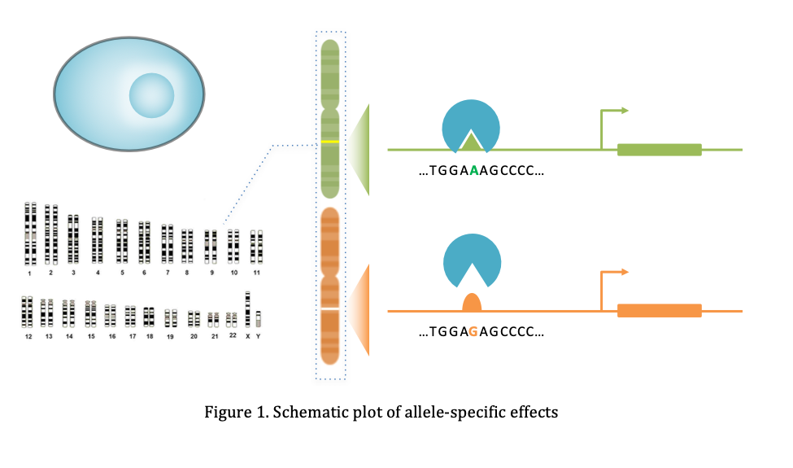
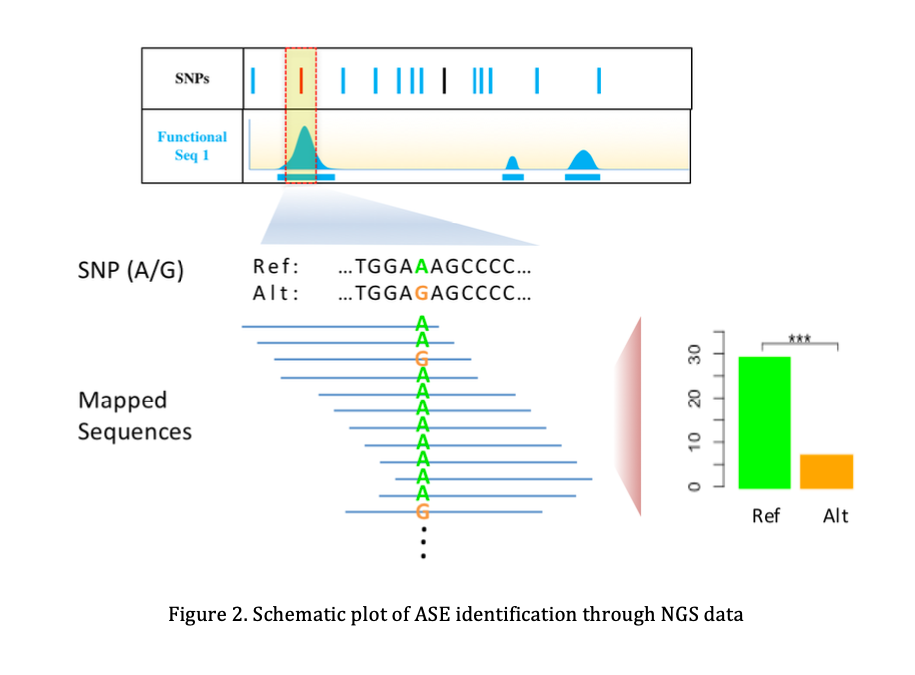

# AlleleSNP Introduction

## 1. Background

Allele-specific effects (ASE) are variations within a single individual, such as differences in chromatin signatures, DNA methylation, and gene expression, that are related to different alleles of a SNP (Birney et al. 2010; Rozowsky et al. 2011). 
When a heterozygous SNP shows ASE of epigenetic signatures, such as transcription factor (TF) binding or histone modifications, it is a strong indication of its functionality because it shows that within the same cellular environment, the two SNP alleles can behave differently (Fig 1). 
ASE can be identified through examination of NGS data: for example, we can collect a TF ChIP-seq reads that mapped to a certain SNP, if the number of reads that contain the reference allele and the alternate allele are imbalanced, it might indicate that the SNP might play a critical role in regulating the binding affinity of the TF (Fig 2).






## 2. Installation

```R
if (!require(AlleleSNP)) {    
    library(devtools)    
    install_github("foreverycc/AlleleSNP_Package")
}
library(AlleleSNP)
```

## 3. Identify ASE by bam files

The first way to identify ASE is through examination of bam files.

For each bam file (ChIP-seq, DNase-seq, ATAC-seq, FAIRE-seq, etc.), AlleleSNP will search for heterozygous given SNPs, then extract the number of reads that contain either the reference or the alternate allele, and finally perform statistical tests (Fig 2).

### 3.1 Input SNP format

```R
assnp_dir = .libPaths()
index_snp_file = paste0(assnp_dir, "/AlleleSNP/extdata/input_snps/input_snp_example2.csv")
df_indexSNP = read.csv(index_snp_file, header = F)
names(df_indexSNP) = c("id", "population")
```

Index SNP output:

| id          | population |
|-------------|-----|
| rs1051730   | EUR |
| rs10937405  | ASN |
| rs8034191   | EUR |
| rs8042374   | EUR |
| rs9387478   | ASN |
| rs402710    | EUR |
| rs139852726 | EUR |
| rs7741164   | ASN |


### 3.2 Input bam files


Folder structure:

```
./extdata/sample/A549/bam_files
├── A549_H3K27ac.bam
├── A549_H3K27ac.bam.bai
├── A549_H3K4me1.bam
├── A549_H3K4me1.bam.bai
├── A549_H3K4me3.bam
├── A549_H3K4me3.bam.bai
├── A549_H3K9ac.bam
├── A549_H3K9ac.bam.bai
├── A549_PolII.bam
└── A549_PolII.bam.bai

```

### 3.3 Get allele-specific binding events by examination of the bam files

```R
get_assnp_byBam(
	index_snp_file = index_snp_file, 
	bam_dir = bam_dir, 
	sample_name = "A549_singleBam"
)
```

Output results:

| rsID        | biofeature  | ref | alt | ref_rmdup | alt_rmdup | genotype_singleBam | genotype_sample | genotype_vcf | genotype_final | biofeature_overlap\_names | biofeature_overlap\_num | biofeature_overlap | ref_count | alt_count | ref_cnv | alt_cnv | p.val.raw  | p.val.cnv  | p.val.cnv.bh | p.val.cnv.bonf |
|-------------|-------------|-----|-----|-----------|-----------|--------------------|-----------------|--------------|----------------|---------------------------|------------------------|--------------------|-----------|-----------|---------|---------|------------|------------|--------------|---------------|
| rs3813570   | A549_PolII  | 49  | 74  | 21        | 26        | TRUE               | NA              | NA           | TRUE           | NA                        | NA                     | NA                 | NA        | NA        | 1       | 1       | 0.03004691 | 0.03004691 | 0.3004691    | 0.3004691     |
| rs31490     | A549\_H3K4me3| 25  | 16  | 14        | 11        | TRUE               | NA              | NA           | TRUE           | NA                        | NA                     | NA                 | NA        | NA        | 1       | 1       | 0.21102360 | 0.21102360 | 0.7420078    | 1.0000000     |
| rs27996     | A549\_H3K4me3| 30  | 21  | 15        | 13        | TRUE               | NA              | NA           | TRUE           | NA                        | NA                     | NA                 | NA        | NA        | 1       | 1       | 0.26243754 | 0.26243754 | 0.7420078    | 1.0000000     |
| rs57064725  | A549\_H3K27ac| 9   | 15  | 7         | 9         | TRUE               | NA              | NA           | TRUE           | NA                        | NA                     | NA                 | NA        | NA        | 1       | 1       | 0.30745625 | 0.30745625 | 0.7420078    | 1.0000000     |
| rs57064725  | A549\_H3K4me3| 23  | 30  | 17        | 15        | TRUE               | NA              | NA           | TRUE           | NA                        | NA                     | NA                 | NA        | NA        | 1       | 1       | 0.41010272 | 0.41010272 | 0.7420078    | 1.0000000     |
| rs684513    | A549\_H3K4me3| 46  | 38  | 18        | 15        | TRUE               | NA              | NA           | TRUE           | NA                        | NA                     | NA                 | NA        | NA        | 1       | 1       | 0.44520467 | 0.44520467 | 0.7420078    | 1.0000000     |
| rs3813570   | A549\_H3K4me3| 54  | 51  | 20        | 22        | TRUE               | NA              | NA           | TRUE           | NA                        | NA                     | NA                 | NA        | NA        | 1       | 1       | 0.84537032 | 0.84537032 | 1.0000000    | 1.0000000     |
| rs503464    | A549_PolII  | 33  | 31  | 21        | 16        | TRUE               | NA              | NA           | TRUE           | NA                        | NA                     | NA                 | NA        | NA        | 1       | 1       | 0.90065325 | 0.90065325 | 1.0000000    | 1.0000000     |
| rs59133824  | A549\_H3K4me3| 78  | 78  | 29        | 28        | TRUE               | NA              | NA           | TRUE           | NA                        | NA                     | NA                 | NA        | NA        | 1       | 1       | 1.00000000 | 1.00000000 | 1.0000000    | 1.0000000     |
| rs59683676  | A549\_H3K4me3| 77  | 77  | 29        | 28        | TRUE               | NA              | NA           | TRUE           | NA                        | NA                     | NA                 | NA        | NA        | 1       | 1       | 1.00000000 | 1.00000000 | 1.0000000    | 1.0000000     |


## 4. Identify ASE by sample

If you have more information of a sample, you could also identify ASE through integrating multiple data types of a sample.

Here, AlleleSNP provides a way to integrate bam files, peak files, and vcf files together to identify ASE. This mode may identify heterozygous SNPs that are not called using a single bam file, but it also requires more prerequisite work, such as peak calling and vcf calling.

### 4.1 In the sample mode, we can incorporate more types of data, including:
- bam files
- peak files (.bed)
- vcf files

Folder structure of the sample


```
./extdata/sample/A549/
│
├── bam_files
│   ├── A549_H3K27ac.bam
│   ├── A549_H3K27ac.bam.bai
│   ├── A549_H3K4me1.bam
│   ├── A549_H3K4me1.bam.bai
│   ├── A549_H3K4me3.bam
│   ├── A549_H3K4me3.bam.bai
│   ├── A549_H3K9ac.bam
│   ├── A549_H3K9ac.bam.bai
│   ├── A549_PolII.bam
│   └── A549_PolII.bam.bai
│
├── peak_files
│   ├── A549_H3K27ac_peaks.bed
│   ├── A549_H3K4me1_peaks.bed
│   ├── A549_H3K4me3_peaks.bed
│   ├── A549_H3K9ac_peaks.bed
│   └── A549_PolII_peaks.bed
│
└── vcf_files
    ├── A549_ChIPseq_GATK.vcf
    ├── A549_ChIPseq_Samtools.vcf
    └── A549_WGS_GATK.vcf
```

### 4.2 Get allele-specific binding events by integrating all the data of the sample

```R
get_assnp_bySample(
	index_snp_file = index_snp_file, 
	sample_name = "A549", 
	sample_dir = sample_dir
)
```

Output results:

| rsID        | biofeature  | ref | alt | ref_rmdup | alt_rmdup | genotype_singleBam | genotype_sample | genotype_vcf | genotype_final | biofeature_overlap | biofeature_overlap_num | biofeature_overlap_names                                                      | ref_count | alt_count | ref_cnv | alt_cnv | p.val.raw  | p.val.cnv  | p.val.cnv.bh | p.val.cnv.bonf |
|-------------|-------------|-----|-----|-----------|-----------|--------------------|-----------------|--------------|----------------|--------------------|------------------------|--------------------------------------------------------------------------------|-----------|-----------|---------|---------|------------|------------|--------------|---------------|
| rs3813570   | A549_PolII  | 49  | 74  | 21        | 26        | TRUE               | TRUE            | TRUE         | TRUE           | TRUE               | 4                      | A549\_H3K27ac\_peaks, A549\_H3K4me3\_peaks,A549\_H3K9ac\_peaks,A549_PolII\_peaks        | 48        | 36        | 1501    | 1558    | 0.03004691 | 0.05533592 | 0.5533592    | 0.5533592      |
| rs57064725  | A549\_H3K27ac| 9   | 15  | 7         | 9         | TRUE               | TRUE            | TRUE         | TRUE           | TRUE               | 4                      | A549\_H3K27ac\_peaks,A549\_H3K4me3\_peaks,A549\_H3K9ac\_peaks,A549_PolII\_peaks        | 29        | 39        | 1501    | 1558    | 0.30745625 | 0.35532555 | 0.8862402    | 1.0000000      |
| rs684513    | A549\_H3K4me3| 46  | 38  | 18        | 15        | TRUE               | TRUE            | TRUE         | TRUE           | TRUE               | 4                      | A549\_H3K27ac\_peaks,A549\_H3K4me3\_peaks,A549\_H3K9ac\_peaks,A549_PolII\_peaks        | 45        | 46        | 1501    | 1558    | 0.44520467 | 0.35803028 | 0.8862402    | 1.0000000      |
| rs27996     | A549\_H3K4me3| 30  | 21  | 15        | 13        | TRUE               | TRUE            | TRUE         | TRUE           | TRUE               | 3                      | A549\_H3K27ac\_peaks,A549\_H3K4me3\_peaks,A549\_H3K9ac\_peaks                         | 27        | 15        | 1754    | 929     | 0.26243754 | 0.40944408 | 0.8862402    | 1.0000000      |
| rs57064725  | A549\_H3K4me3| 23  | 30  | 17        | 15        | TRUE               | TRUE            | TRUE         | TRUE           | TRUE               | 4                      | A549\_H3K27ac\_peaks,A549\_H3K4me3\_peaks,A549\_H3K9ac\_peaks,A549_PolII\_peaks        | 29        | 39        | 1501    | 1558    | 0.41010272 | 0.49624781 | 0.8862402    | 1.0000000      |
| rs31490     | A549\_H3K4me3| 25  | 16  | 14        | 11        | TRUE               | TRUE            | TRUE         | TRUE           | TRUE               | 4                      | A549\_H3K27ac\_peaks,A549\_H3K4me1\_peaks,A549\_H3K4me3\_peaks,A549\_H3K9ac\_peaks      | 30        | 8         | 1754    | 929     | 0.21102360 | 0.67303236 | 0.8862402    | 1.0000000      |
| rs3813570   | A549\_H3K4me3| 54  | 51  | 20        | 22        | TRUE               | TRUE            | TRUE         | TRUE           | TRUE               | 4                      | A549\_H3K27ac\_peaks,A549\_H3K4me3\_peaks,A549\_H3K9ac\_peaks,A549_PolII\_peaks        | 48        | 36        | 1501    | 1558    | 0.84537032 | 0.70660674 | 0.8862402    | 1.0000000      |
| rs503464    | A549_PolII  | 33  | 31  | 21        | 16        | TRUE               | TRUE            | TRUE         | TRUE           | TRUE               | 4                      | A549\_H3K27ac\_peaks,A549\_H3K4me3\_peaks,A549\_H3K9ac\_peaks,A549_PolII\_peaks        | 24        | 38        | 1501    | 1558    | 0.90065325 | 0.78816140 | 0.8862402    | 1.0000000      |
| rs59133824  | A549\_H3K4me3| 78  | 78  | 29        | 28        | TRUE               | TRUE            | TRUE         | TRUE           | TRUE               | 4                      | A549\_H3K27ac\_peaks,A549\_H3K4me3\_peaks,A549\_H3K9ac\_peaks,A549_PolII\_peaks        | 42        | 55        | 1501    | 1558    | 1.00000000 | 0.88474339 | 0.8862402    | 1.0000000      |
| rs59683676  | A549\_H3K4me3| 77  | 77  | 29        | 28        | TRUE               | TRUE            | TRUE         | TRUE           | TRUE               | 4                      | A549\_H3K27ac\_peaks,A549\_H3K4me3\_peaks,A549\_H3K9ac\_peaks,A549_PolII\_peaks        | 40        | 53        | 1501    | 1558    | 1.00000000 | 0.88624024 | 0.8862402    | 1.0000000      |

